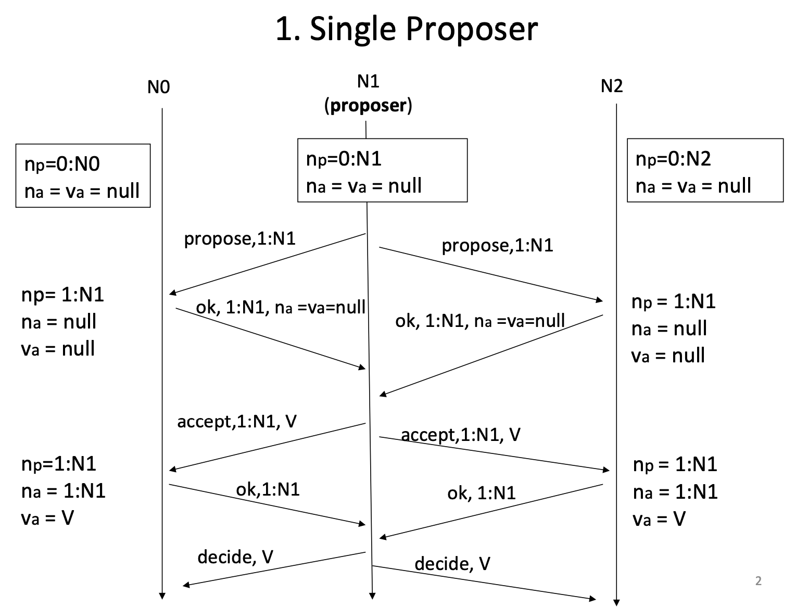

# Team Paxos Cpp
Xijiao Li (xl2950) \
Luofei Zhang (lz2649) \
Jiawei Zhang (jz3209)

In this project, we implement Paxos, a consensus algorithm, in C++. Among the many benefits offered by distributed systems, fault tolerance makes a system more robust and available to provide service even in the case of failure of servers, network latency, or network failure. Distributed systems achieve fault tolerance by replicating data on a few servers placed in different locations. However, it is generally difficult to guarantee that all replicas have the same state. Paxos can be used to maintain the consistency among replicas as long as the majority of the cluster is still available. 

To make a cluster of nodes agree on the state, we can alternatively make them agree on a series of events that cause the final state. As long as the nodes agree on the order and content of each event, they can replay them locally and arrive at the same state eventually. Now we focus on how to agree on a series events. To agree on the relative order of all events, we assign a global sequential number to each event and each event is associated with a unique number. In this way, we successfully embed the order into the content of the events. Up to now, we have further broken down the problem to making servers agree on a single event. Luckily, this is exactly the problem solved by Paxos. I will give a brief introduction of how Paxos works below and I highly suggest you refer to the post https://columbia.github.io/ds1-class/lectures/07-paxos.pdf written by my professor at Columbia University in order to get a deep understanding of the beauty of Paxos. 

There are three stages in Paxos, Propose, Accept, and Decide. 
Each node can either be a proposer or acceptor. When the node would like to propose something, it becomes a proposer. When the node has nothing to propose, it is an acceptor. Notice that a node can be a proposer for one event and an acceptor for another event at the same time. 
Let me present the Paxos protocol first:


### Phase 1 (Propose) 
Proposer steps:
- Chooses a new proposal number, N 
- Sends to acceptors (includes himself) 
- Waits until a majority of acceptors return PROPOSE-OK responses 
- If time out waiting, back off then restart Paxos

Acceptor steps: \
// Acceptors maintain some state: \
// Na: highest accepted proposal \
// Va: the value of the highest accepted proposal \
// Np: highest proposal number they've seen to date. 
- Upon receiving a request: \
If N > Np \
then update Np = N \
return PROPOSE-OK,Na,Va \
Else: return REJECT,Np


### Phase 2 (Accept) 
Proposer steps: 
- If proposer gets PROPOSE-OK responses from a majority of acceptors: 
 1. Choose V = the value of the highest-numbered proposal among those returned by the acceptors (or any value he wants if no Va was returned by any acceptor) 
2. Send to all nodes (acceptors) 
3. Wait until a majority of acceptors returns ACCEPT-OK response 
- Else, or if time out waiting, then back off then restart Paxos

Acceptor steps:
 - Upon receiving an : 
    If N >= Np then: 
update Np = N, Na = N, Va = V 
return ACCEPT-OK, N 
Else: return REJECT, Np


### Phase 3 (Decide) 
Proposer steps: 
- If proposer gets ACCEPT-OK responses from a majority of acceptors: 
1. Return Done to client, signaling that consensus has been reached. // Client can now: enter a critical section, start behaving as a leader, etc. – whatever the value signified to him. 
2. Send to all replicas, and keep sending until you get DECIDE-OKs from everyone. // This phase is so that nodes close the protocol, and so that nodes that might not have heard previous ACCEPT messages learn the chosen value. 
- Else back off then restart Paxos
[1]

Below is the pseudocode of Paxos [2]

```
proposer(v):
 while not decided:
   choose n, unique and higher than any n seen so far
   send prepare(n) to all servers including self
   if prepare_ok(n_a, v_a) from majority:
     v' = v_a with highest n_a; choose own v otherwise
     send accept(n, v') to all
     if accept_ok(n) from majority:
       send decided(v') to all

acceptor's state:
 n_p (highest prepare seen)
 n_a, v_a (highest accept seen)

acceptor's prepare(n) handler:
 if n > n_p
   n_p = n
   reply prepare_ok(n_a, v_a)
 else
   reply prepare_reject

acceptor's accept(n, v) handler:
 if n >= n_p
   n_p = n
   n_a = n
   v_a = v
   reply accept_ok(n)
 else
   reply accept_reject

```

I have listed steps for proposer and acceptor on each stage. Here are a few comments to help your better understand it. The core foundation of Paxos is that the union of any two majorities of a cluster is not empty. For instance, in a cluster consists of five nodes, A,B,C,D,E, ABC forms a majority, BCE forms a majority. They share one node B. Any such majorities share at least one common node. It is worth noting that once a value is determined by a node, it will never change it. So once the majority reached the agreement, latter node cannot agree on anything else except the value agreed by the majority. 

In our project, we represent the global sequential order as an integer and events as string or integer values but you can adjust it to whatever you want. Our cluster can make progress on multiple events in parallel. Event number i can be handled even if event i-1 is not completed. The final result is that all servers in the cluster would have the same order of logs provided by the client. Since logs are replicated on all of the servers, our system can still serve the client even though a minority of server fail. This is usually referred to high availability in the industry. 

## Appendix A

A few examples on how Paxos helps servers reach agreement. [2]

 \
 \
 \


## Reference

[1]  https://columbia.github.io/ds1-class/lectures/07-paxos.pdf \
[2]  https://columbia.github.io/ds1-class/lectures/07-paxos-functioning-slides.pdf


